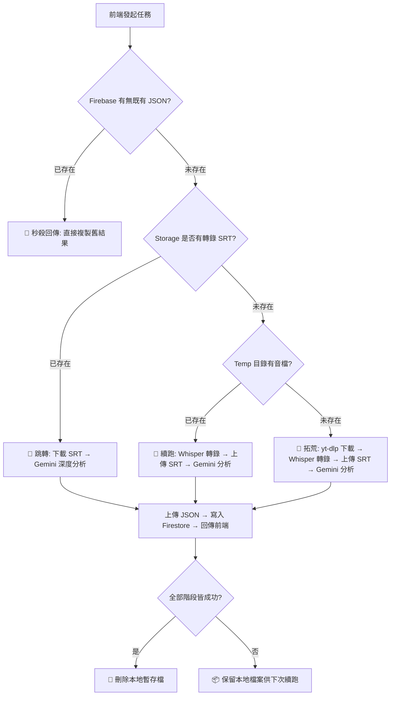

# AI Podcast 分析助手 (WhisGe - 本地 GPU 加速版)

## 📖 專案簡介
這是一個由前端網頁與 Python 後端交織而成的 Podcast / YouTube 音訊分析系統。透過強大的影音提取器 (yt-dlp) 自動下載目標影片的語音或攔截既有字幕，接著使用本地的 **GPU 加速 OpenAI Whisper 模型** 進行快速文字轉錄，最終將極高精度的逐字稿交由 **Google Gemini 模型** 進行洞見分析、提取重點精華、並條列出相關發燒個股。

本分支專案為了解決原本架構中 YouTube 常見的機房 IP 封鎖與外部 API 限速，全面脫離了雲端與 Groq，打造出純種的 **Local First (本機優先)** 設計。

---

## 🏗️ 系統架構與模組說明

### 核心目錄與檔案樹狀圖 (File Tree)
```text
📦 podcast-analyzer
 ┣ 📜 index-local.html          # 前端：極簡網頁介面與浮動對話視窗
 ┣ 📜 main_local.py             # 後端：大腦管家 (API、排程與路由)
 ┣ 📜 processor_local.py        # 引擎：核心運算管線 (yt-dlp + Whisper + Gemini 分析)
 ┣ 📜 chat_Gemini_local.py      # 對話：本機 Gemini Chat 核心模組 
 ┗ 📜 firebase_storage_local.py # 儲存：Firebase Storage 取用與持久化
```

### 模組功能對照表
| 模組名稱 | 負責功能 | 架構亮點 |
|----------|----------|----------|
| **前端網頁** (`index-local.html`) | UI 渲染、狀態暗號發送、仿 AdminLTE 對話視窗 | 使用 `pending_local` 暗號確保本機後端專屬接單，與雲端系統和平共存不搶單。 |
| **大腦管家** (`main_local.py`) | 任務排程、資料庫監聽、快取攔截 | 攔截成功即可 0 秒回傳 (0% 算力消耗)；資料與暫存路徑全自動處理。 |
| **處理引擎** (`processor_local.py`) | 網址解析、下載、轉錄、生成 AI 報告 | 無 25MB 大小限制，100% 釋放本地 GPU 算力；高強制性繁體中文 Prompting。 |
| **對話系統** (`chat_Gemini_local.py`) | 管理多輪對話 Session、狀態持久化 | 獨立記憶體隔離；附帶 3 秒極速 503/429 智能重試機制。 |
| **儲存傳遞** (`firebase_storage_local.py`) | 處理檔案上傳 / 下載 / 簽名網址產生 | 將跑完的 SRT / JSON 安全且持久地掛載於 Firebase Cloud Storage。 |

---

## ⚙️ 核心流程圖 (Core Workflow)



---

## 🛠️ 環境配置與啟動指南

| 步驟 | 說明 | 執行指令 / 動作 |
|------|------|-----------------|
| **1. 安裝環境** | 為確保 GPU 調用，建議使用已裝妥 CUDA 之 Anaconda 或虛擬環境 | `pip install -r requirements.txt` |
| **2. 設置金鑰** | 複製 `.example` 檔案並填寫嚴禁外流的 API 參數 | 1. 建立 `.env` 填妥 GEMINI_API_KEY <br> 2. 建立 `serviceAccountKey.json` |
| **3. 啟動後端** | 啟動 Python 監聽服務，準備接單 | `python main_local.py` |
| **4. 啟動前端** | 使用 Live Server 啟動 HTML 介面進行測試 | 開啟 `index-local.html` |

> 💡 **Tip:** 啟動後貼上任意 YouTube 或 ApplePodcast 網址，即可體驗無限制的極速解析與互動式 AI 對話！

---

## 🛡️ 資安與 GitHub 提交建議 

| 檔案/類型 | 上傳安全性 | 說明限制 |
|-----------|------------|----------|
| `index-local.html` | ✅ **安全** | 內含的 apiKey 為公開識別碼，受 Firebase Security Rules 保護。 |
| `.py` 腳本群 | ✅ **安全** | 敏感金鑰已全面清理並掛載 `.env`，可放心 push 上傳。 |
| `requirements.txt` | ✅ **安全** | 環境依賴檔。 |
| `.env` | ❌ **嚴禁上傳** | 內含 Gemini AI 扣款點數！請確認已加入 `.gitignore`。 |
| `serviceAccountKey...`| ❌ **嚴禁上傳** | 內含資料庫最高改寫權限！請確認已加入 `.gitignore`。 |

---

## 📋 系統機制與近期優化亮點

### 1. 三層快取與資料流機制
系統設計了極高的容錯與斷點續跑能力：

| 快取層級 | 檢查目標 | 命中觸發動作 |
| :--- | :--- | :--- |
| **Layer 1** | Firestore `transcripts` 集合 | 直接回傳前端 (0 秒) |
| **Layer 2** | Firebase Storage 資料夾 | 下載 SRT &rarr; 直接進入 Gemini 分析 |
| **Layer 3** | 本地 `%TEMP%` 目錄 | 跳過下載 &rarr; 直接 Whisper 轉錄 |
| **Layer 4** | 什麼都沒有 | 完整從頭拓荒 |

### 2. 資料存放架構設計
存放路徑全面採用 **URL 的 MD5 Hash**，確保跨平台 (雲端/地端) 完美共享。

| 資料類型 | Firebase Storage 存放狀態 | Firestore (資料庫) 存放狀態 |
| :--- | :--- | :--- |
| **SRT 逐字稿** | ✅ 完整 `.srt` 檔案 | ❌ 只記錄網址 |
| **JSON 分析報告** | ✅ 完整 `.json` 檔案 | ✅ 拆分各欄位儲存 (供前端 UI 渲染用) |
| **Metadata 資訊** | ❌ (僅輔助檔名命名) | ✅ 儲存時長、縮圖於 `tasks` 集合 |

### 3. 特殊優化與修復紀錄
| 系統類別 | 優化項目 | 升級說明 |
|----------|----------|----------|
| **健壯性** | 環境預檢 (Preflight) | 啟動時自動檢查金鑰設定，若未設定即安全防呆暫停。 |
| **高可用性** | AI 極速重試機制 | 遇 503 HTTP 或 429 配額超載錯誤，僅遲延 **3秒** 即自動重連 (最多重試 3 次)。 |
| **記憶體防護** | 連線截斷防護 | 將 `google.genai.Client` 實體與狀態強制綁定，封殺 Garbage Collection 造成的 Session 閃退。 |
| **使用者體驗** | UI 動態回饋與心跳 | 加入實體連線心跳燈號設計、10 秒等待壅塞提示自動染橘機制，消解等待焦慮。 |
