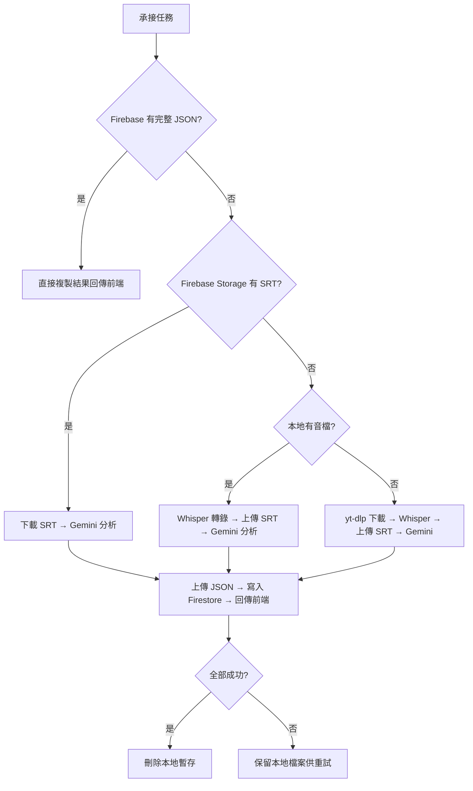

# 重構本地版 Podcast Analyzer：環境預檢 + 斷點續跑

## 問題背景

目前的架構是「全有或全無」模式：任何步驟失敗都會導致整個任務報錯，且已完成的中間產物（音檔、SRT）會被 `shutil.rmtree` 清掉，下次必須從頭開始。

## 改動目標

1. **啟動時預檢環境**：Python 一啟動就驗證 `GEMINI_API_KEY` 和 `serviceAccountKey.json`，不通過直接終止。
2. **承接任務前的三層快取檢查**：Firebase 有 JSON → 有 SRT → 本地有音檔，能從哪裡接就從哪裡接。
3. **各步驟完成即上傳**：SRT 轉完立即上傳 Firebase Storage；JSON 分析完立即上傳。
4. **失敗不刪檔**：只有全部成功才刪除本地音檔；SRT/JSON 已上傳雲端所以可刪。

---

## Proposed Changes

### main_local.py

#### 1. 新增啟動預檢函式

在 `if __name__ == "__main__":` 區塊最前面呼叫預檢，未通過直接 `sys.exit(1)`：

```python
def preflight_check():
    """啟動時預先檢查所有必要的環境設定"""
    print("🔍 正在執行環境預檢...")
    errors = []
    
    # 檢查 serviceAccountKey.json
    base_dir = os.path.dirname(os.path.abspath(__file__))
    local_key = os.path.join(base_dir, "serviceAccountKey.json")
    cloud_key = "/etc/secrets/serviceAccountKey.json"
    if not os.path.exists(cloud_key) and not os.path.exists(local_key):
        errors.append(f"❌ 找不到 serviceAccountKey.json (已搜尋: {local_key})")
    
    # 檢查 GEMINI_API_KEY
    from dotenv import load_dotenv
    load_dotenv(os.path.join(base_dir, ".env"))
    if not os.environ.get("GEMINI_API_KEY"):
        errors.append("❌ 環境變數 GEMINI_API_KEY 未設定 (請檢查 .env 檔案)")
    
    if errors:
        print("\n🚨 環境預檢失敗！以下問題必須修正後才能啟動：")
        for e in errors:
            print(f"   {e}")
        sys.exit(1)
    
    print("✅ 環境預檢通過！")
```

#### 2. 重構 `handle_new_task` 的快取檢查邏輯

改為三層遞進式快取：

```
承接任務 →
  ① Firebase transcripts 有完整 JSON 結果？ → 直接回傳前端
  ② Firebase Storage 有 SRT？               → 下載 SRT，跳到 Gemini 分析
  ③ 本地 temp 有音檔？                       → 跳到 Whisper 轉錄
  ④ 都沒有                                   → 從 yt-dlp 下載開始
```

#### 3. 修改清理邏輯

`finally` 區塊改為：只在「任務全部成功」時刪除暫存目錄。失敗時保留檔案以供後續重試。

```python
# 原始邏輯 (finally 無條件清除) → 改為只在成功時清除
```

> [!IMPORTANT]
> 改動 `finally` 區塊：引入一個 `task_success` 旗標，只有在 `completed` 時才執行 `shutil.rmtree`。

---

### processor_local.py

#### 1. 拆分 `process_audio_pipeline` 回傳結構

目前回傳 `(srt_path, json_path, json_data, audio_path)` 四元素。
改為回傳一個 `dict`，讓 `main_local.py` 可以依照階段性結果做個別處理：

```python
return {
    "srt_path": local_srt,
    "json_path": local_json,
    "json_data": json_data,
    "audio_path": final_audio,
    "srt_content": trans_srt,  # SRT 原文內容 (供快取用)
}
```

#### 2. 新增獨立函式：僅執行 Gemini 分析

從現有 pipeline 中抽出 Step 4 (Gemini) 為獨立函式：

```python
def run_gemini_analysis(srt_content, task_id, db):
    """僅執行 Gemini 分析步驟，接受 SRT 純文字內容"""
```

這讓 `main_local.py` 拿到雲端的 SRT 後可以直接呼叫此函式，不需要跑完整 pipeline。

---

### firebase_storage_local.py

#### 新增 `check_file_exists` 與 `download_file_from_storage` 函式

用於在承接任務時檢查雲端是否已有 SRT 檔案，以及下載該檔案：

```python
def check_file_exists(cloud_path):
    """檢查 Firebase Storage 上的檔案是否存在"""
    
def download_file_from_storage(cloud_path, local_path):
    """從 Firebase Storage 下載檔案到本地"""
```

---

### index-local.html

> [!NOTE]
> 前端不需要修改。所有改動都在後端 Python 層。前端依然透過 `onSnapshot` 監聽 `tasks` 和 `transcripts`，流程不變。

---

## 新的任務處理流程圖



---

## Open Questions

> [!IMPORTANT]
> **SRT 的雲端路徑格式**：目前 SRT 上傳路徑是 `transcripts/{taskId}/{標題}.srt`。但同一個 URL 可能會產生多個 taskId。要用 **taskId** 還是用 **URL 的 hash** 作為雲端路徑的 key？
> - 用 taskId：每次重試都是新路徑，之前的 SRT 不會被覆蓋，但也找不到。
> - 用 URL hash：同一 URL 的 SRT 永遠存在同一個路徑，方便第二層快取檢查。
> 
> **建議採用 URL hash**，這樣第二層快取（檢查 SRT 是否存在）才能跨 taskId 運作。

---

## Verification Plan

### Manual Verification
1. **預檢測試**：故意刪除 `.env` 中的 `GEMINI_API_KEY`，啟動程式確認會在啟動階段就報錯終止。
2. **Gemini 失敗測試**：送出一個正常任務，在 Gemini 分析步驟前手動斷網，確認 SRT 已上傳且本地檔案保留。
3. **斷點續跑測試**：重新啟動程式，對同一個 URL 再送一次任務，確認能從 SRT 快取接續 Gemini 分析。
4. **完整成功測試**：正常跑完一個完整任務，確認本地暫存被清除。
